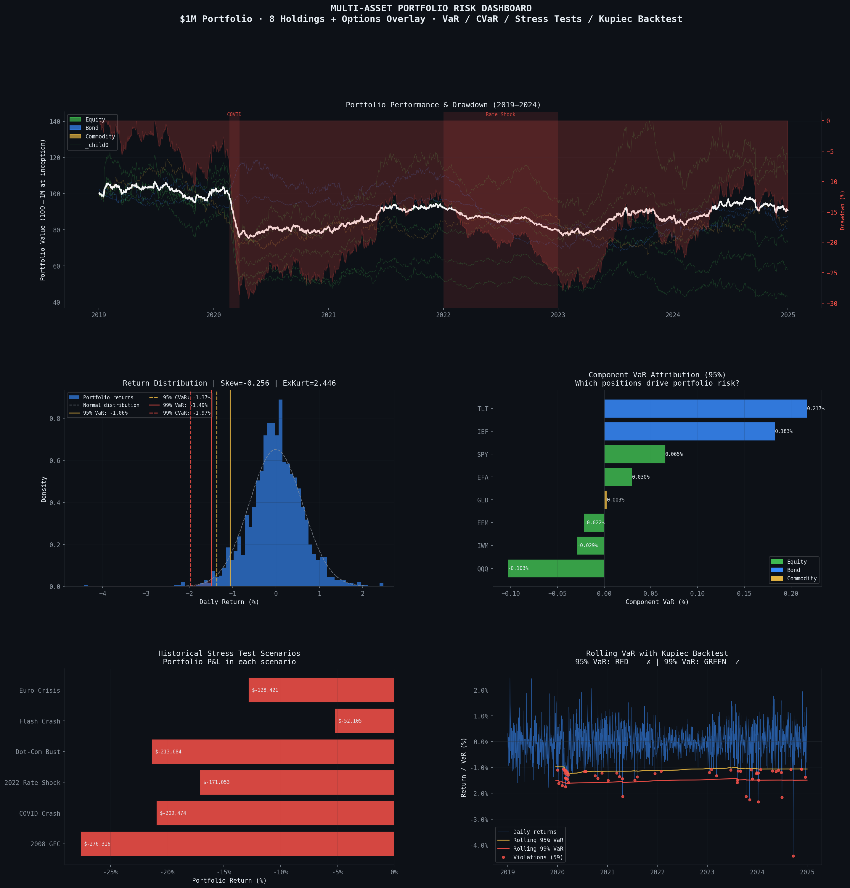

# Multi-Asset Portfolio Risk Dashboard

Institutional-style risk engine for a $1M multi-asset portfolio, computing VaR, CVaR, stress tests, options Greeks, and statistically validating the VaR model itself with a Kupiec backtest.

## Problem

Every risk desk needs to answer two questions every day: how much could this portfolio lose, and can we trust that number? This dashboard answers both — it computes risk estimates across multiple methodologies and then tests whether those estimates actually held up against real portfolio behavior.

## Portfolio

$1M notional across 8 holdings plus an options overlay:
- **Equities (60%):** SPY, QQQ, IWM, EFA, EEM
- **Bonds (25%):** TLT, IEF
- **Commodities (10%):** GLD
- **Options overlay (5%):** SPY covered call + protective put, priced with Black-Scholes

## Methodology

**VaR (Value at Risk)** — computed three ways: Historical Simulation, Parametric (Delta-Normal), and Monte Carlo with Cholesky decomposition for correlated asset paths. Showing the range across methods is more honest than presenting one number as ground truth.

**CVaR / Expected Shortfall** — the average loss in the tail beyond VaR, since VaR alone doesn't say how bad the bad days get.

**Risk attribution** — Marginal VaR and Component VaR per position, so you can see which holdings are actually driving portfolio risk (bonds, via TLT and IEF, turned out to be the largest contributors here).

**Options Greeks** — full Black-Scholes Greeks (Delta, Gamma, Vega, Theta, Rho) for the options overlay, since a covered call and a protective put change the portfolio's effective exposure in ways a plain equity weight doesn't capture.

**Stress testing** — six historical scenarios (2008 GFC, COVID crash, 2022 rate shock, dot-com bust, flash crash, Euro crisis) applied to current portfolio weights.

**Kupiec POF backtest** — the statistical test regulators require (Basel III/IV) to check whether a VaR model's actual violation rate matches its assumed confidence level. Uses the Basel traffic-light system: Green/Yellow/Red based on violation count over the sample.

## Data

Returns are generated by a calibrated synthetic price engine rather than pulled live, so the notebook is fully reproducible without an API key or data availability issues. The generator uses realistic cross-asset correlations, Student-t distributed shocks (fat tails, matching real market behavior better than a normal distribution), and asset-specific crisis dispersion calibrated to how each asset actually behaved historically. Swapping in live data via `yfinance` is a straightforward next step (see below).

## Results

| Metric | Value |
|---|---|
| 1-Day 95% VaR (Historical Sim) | $10,603 |
| 1-Day 99% VaR (Historical Sim) | $14,911 |
| 1-Day 99% CVaR (Expected Shortfall) | $19,704 |
| Portfolio Annualized Vol | 9.71% |
| Worst Stress Scenario (2008 GFC) | -27.63% |
| Kupiec 95% VaR Backtest | RED — model rejected |
| Kupiec 99% VaR Backtest | GREEN — model accepted |

The 95% VaR model failed its own backtest (too many violations relative to the assumed 5% rate), while the 99% model passed. That's a real and useful finding: it shows the historical-simulation approach underestimates risk at the 95% confidence level for this portfolio, which is exactly what a backtest is supposed to catch before a model gets used to size real risk limits.

## Tech Stack

Python · pandas · numpy · scipy · matplotlib · seaborn · arch (GARCH)

## How to Run

## Limitations & Next Steps

- Returns are synthetic, not live market data — swapping in `yfinance` for the price pull is the first upgrade (data pipeline is already structured to make this a drop-in change)
- Add 10-day VaR scaling (√10 rule) per Basel requirements
- Add GARCH(1,1) time-varying volatility to the parametric VaR (partially scaffolded already)
- Extend backtesting with the Christoffersen independence test to check whether violations cluster in time, not just how many there are
